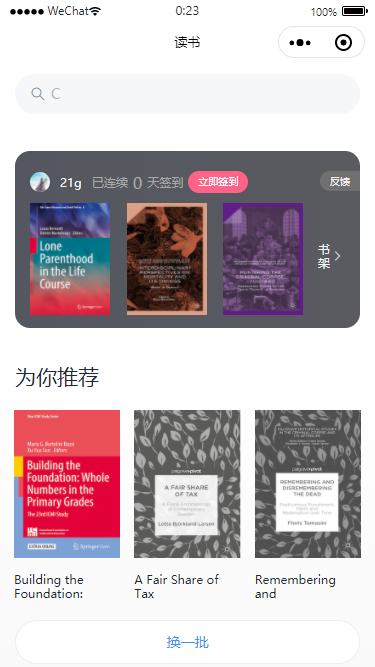
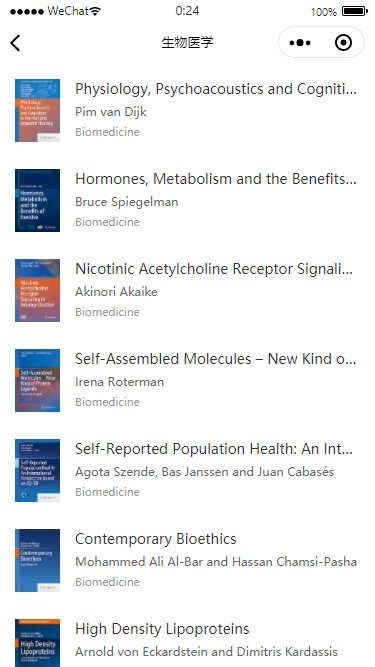
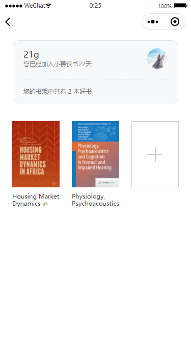
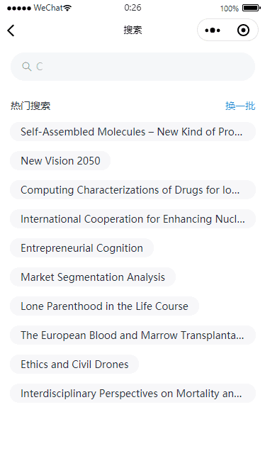
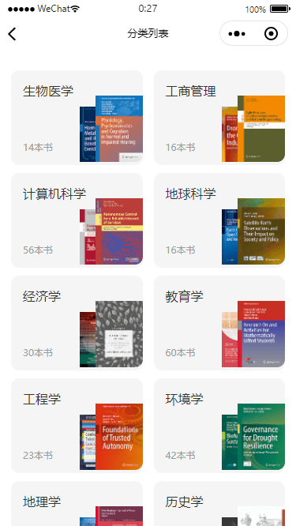

# miniprogram-ebook

## 项目介绍

本项目使用 `mpvue + Vant Weapp` 开发。主要包括首页、搜索模块、图书列表、图书详情、书架模块。

## 如何运行

+ 克隆代码：`https://github.com/MiniProgramToLRH/miniprogram-ebook.git`
+ 安装依赖：`npm install`
+ 运行打包：

  ``` bash
  # 开发时构建
  npm dev

  # 打包构建
  npm build

  # 指定平台的开发时构建(微信、百度、头条、支付宝)
  npm run dev:wx
  npm run dev:swan
  npm run dev:tt
  npm run dev:my

  # 指定平台的打包构建
  npm run build:wx
  npm run build:swan
  npm run build:tt
  npm run build:my

  # 生成 bundle 分析报告
  npm run build --report
  ```

+ 微信小程序查看：使用微信开发者工具导入 `/dist/wx` 目录查看

## 基础知识

+ 错误处理：[error.js](./src/utils/error.js)
+ 小程序获取权限兼容处理：[参考wechat.js](./src/api/wechat.js)

## 使用插件/模块

+ [flyio](https://wendux.github.io/dist/#/doc/flyio/readme)：一个支持所有JavaScript运行环境的基于Promise的、支持请求转发、强大的http请求库

## 项目展示







